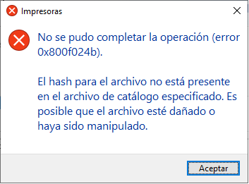
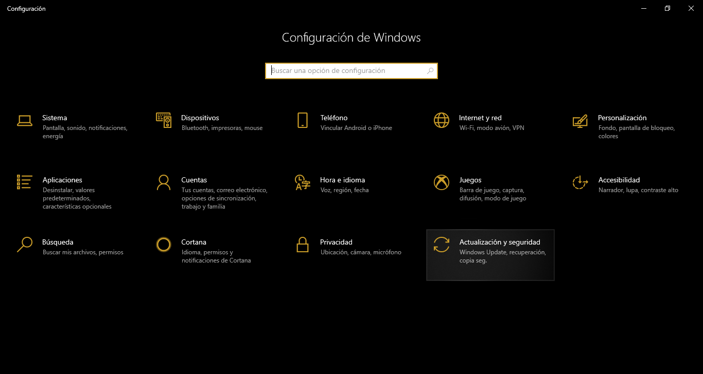
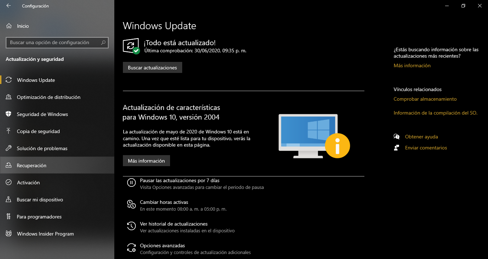
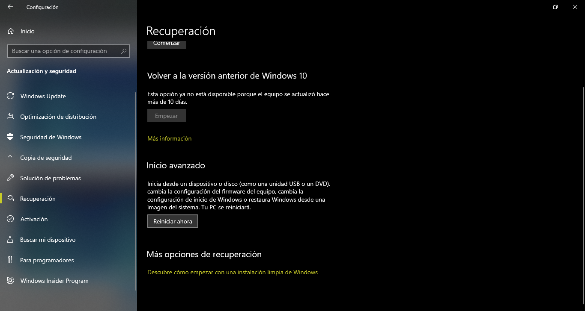

# Instalación de drivers para Samsung-ML1710
## Para windows 10 o posterior
**Nota importante:** Si se desea instalar éste controlador sin realizar los pasos previos, los más probable es que el Sistema Operativo retorne un error del siguiente tipo.

Éste error se debe a que los controladores de la Samsung-ML1710 en su momento no requerían del uso obligatorio de controladores firmados, a menos que la configuración de su computadora sea la indicada para no solicitarlos, es necesario realizar los siguientes pasos.

### Reinicio para no solicitar controladores firmados
1. Acceder al menú de configuración de Windows, esto se puede realizar utilizando la combinación de teclas Windows+i o presionando la tecla Windows y dar click en el ícono de configuración.
2. En la pantalla que nos aparecerá seleccionaremos el rubro de 'Actualización y Seguridad'.

3. Daremos click en 'Recuperación'

4. Una vez que aparezca el menú, avanzaremos hacia la parte inferior en donde aparezca la opción 'Inicio avanzado'.

5. Una ves que se reincie la computadora nos mostrará el siguiente Menú.

6. Daremos click o seleccionaremos la opción 'Solucionar Problemas'.

7. Dentro de esta selección nos mostrará una serie de opciones de las cuales eligiremos la de 'Opciones Avanzadas'.

8. Como parte de lo anterior daremos click en 'Configuración de inicio'.

9. Penúltimamente clickearemos en el único botón existente dentro de esta opción 'Reiniciar'.

10. De nuevo se reiniciará nuestra computadora, solo que ahora nos solicitará los diversos servicios que queremos habilitar o deshabilitar. Para seleccionar alguno de ellos tendremos que utilizar las teclas de la parte superior de nuestro teclado denominadas con la letra F#, presionaremos la tecla F7 con la finalidad de poder deshabilitar el servicio que requiere el uso obligatorio de controladores firmados.

### Instalación desde el instalador

Una vez que hemos ingresado a nuestra computadora tendremos que proceder con la instalación normal de los controladores, aceptando los diversos términos y condiciones, además de que casi al término del proceso nos cuestionará sobre poder instalar los controadores sin firma, daremos click en 'Instalar de todos modos' y finalmente se terminará el proceso de instalación de los drivers que deseamos para la Samsung-ML1710.

## Referencias
- https://answers.microsoft.com/es-es/windows/forum/windows_10-other_settings-winpc/windows-10-acceder-en-modo-seguro-usando-las/9ce9a890-f058-47a5-b597-b04ff434bfa8
- https://darkchicles.com/2016/10/27/windows-8-8-1-y-10-instalar-drivers-sin-firma-digital-deshabilitar-el-uso-obligatorio-de-controladores-firmados/